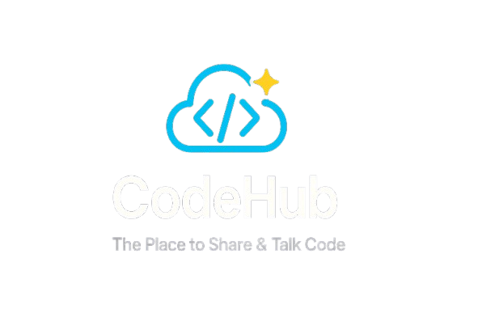

<div align="center">
  
  <h1>CodeHub Application</h1>
  <p><strong>A modern platform for developers to share, discover, and collaborate on code snippets</strong></p>
  <p><em>Phát triển bởi: Nguyễn Trần Gia Sĩ | Cập nhật: 26/06/2025</em></p>
</div>

<p align="center">
  <a href="https://reactjs.org/"></a>
  <a href="https://spring.io/projects/spring-boot"></a>
  <a href="https://mariadb.org/"></a>
  <a href="https://www.docker.com/"></a>
  <a href="https://vitejs.dev/"></a>
  <a href="https://cloudinary.com/"></a>
</p>

## 🚀 Overview

CodeHub is a comprehensive platform designed for developers to share, discover, and collaborate on code snippets. Whether you're looking to showcase your coding solutions, find inspiration, or learn from the community, CodeHub provides an intuitive and feature-rich environment for all your code sharing needs.

## ✨ Features

### 🔍 **Discovery & Search**
- Advanced search functionality with filters by language, tags, and popularity
- Trending snippets based on likes and views
- Language-specific browsing
- Smart recommendations

### 👤 **User Management**
- Secure user authentication and authorization
- User profiles with snippet collections
- Activity tracking and statistics
- Social features (following, bookmarks)

### 📝 **Snippet Management**
- Create, edit, and delete code snippets
- Syntax highlighting for 15+ programming languages
- Multi-file snippet support
- Version history tracking
- Privacy controls (public, unlisted, private)

### 💬 **Community Features**
- Comment system for snippets
- Like and bookmark functionality
- User ratings and feedback
- Share snippets via links

### 🎨 **Modern UI/UX**
- Responsive design for all devices
- Dark theme optimized for coding
- Smooth animations and transitions
- Intuitive navigation

## 🛠️ Tech Stack

### Frontend
- **React 18** - Modern UI library
- **Vite** - Fast build tool and development server
- **Tailwind CSS** - Utility-first CSS framework
- **Framer Motion** - Animation library
- **React Router** - Client-side routing
- **Lucide React** - Beautiful icons
- **React Hot Toast** - Notifications

### Backend
- **Spring Boot 3** - Java framework
- **Spring Security** - Authentication and authorization
- **Spring Data JPA** - Database abstraction
- **MySQL** - Primary database
- **Redis** - Caching and rate limiting
- **JWT** - Token-based authentication
- **Maven** - Dependency management

### Development Tools
- **ESLint** - Code linting
- **Prettier** - Code formatting
- **Postman** - API testing
- **Git** - Version control

## 📁 Project Structure

```
CodeHub/
├── CodeHub-Frontend/          # React frontend application
│   ├── src/
│   │   ├── components/        # Reusable UI components
│   │   ├── pages/            # Page components
│   │   ├── contexts/         # React contexts
│   │   ├── services/         # API services
│   │   └── constants/        # Constants and configurations
│   ├── public/               # Static assets
│   └── package.json          # Frontend dependencies
├── CodeHub-Backend/           # Spring Boot backend application
│   ├── src/main/java/        # Java source code
│   │   ├── controller/       # REST controllers
│   │   ├── service/          # Business logic
│   │   ├── repository/       # Data access layer
│   │   ├── entity/           # JPA entities
│   │   ├── dto/              # Data transfer objects
│   │   └── security/         # Security configurations
│   ├── src/main/resources/   # Configuration files
│   └── pom.xml               # Backend dependencies
└── README.md                 # Project documentation
```

## 🚀 Quick Start

### Prerequisites

Before running the application, make sure you have the following installed:

- **Node.js** (v19 or higher)
- **Java** (v21 or higher)
- **Maven** (v3.6 or higher)
- **MySQL** (v8.0 or higher)
- **Redis** (v6.0 or higher)

### Backend Setup

1. **Clone the repository**
   ```bash
   git clone https://github.com/giasinguyen/codehub.git
   cd codehub
   ```

2. **Configure the database**
   ```bash
   # Create MySQL database
   mysql -u root -p
   CREATE DATABASE codehub;
   ```

3. **Configure application properties**
   ```bash
   cd CodeHub-Backend/src/main/resources
   # Update application.properties with your database credentials
   ```

4. **Run the backend**
   ```bash
   cd CodeHub-Backend
   ./mvnw spring-boot:run
   ```

   The backend will start on `http://localhost:8080`

### Frontend Setup

1. **Install dependencies**
   ```bash
   cd CodeHub-Frontend
   npm install
   ```

2. **Start the development server**
   ```bash
   npm run dev
   ```

   The frontend will start on `http://localhost:5173`

### Testing the Application

1. **Backend API Testing**
   - Import the Postman collection from `CodeHub-Backend/CodeHub_API_Collection.postman_collection.json`
   - Test API endpoints using the provided test credentials:
     - Username: `iamgiasi`
     - Password: `password`

2. **Frontend Testing**
   - Navigate to `http://localhost:5173`
   - Create an account or use the demo credentials
   - Explore the features and functionality

## 📚 API Documentation

The backend provides RESTful APIs for all functionalities:

### Authentication Endpoints
- `POST /api/auth/login` - User login
- `POST /api/auth/register` - User registration
- `POST /api/auth/logout` - User logout
- `GET /api/auth/refresh` - Refresh token

### Snippet Endpoints
- `GET /api/snippets` - Get all snippets (paginated)
- `GET /api/snippets/{id}` - Get snippet by ID
- `POST /api/snippets` - Create new snippet
- `PUT /api/snippets/{id}` - Update snippet
- `DELETE /api/snippets/{id}` - Delete snippet
- `GET /api/snippets/search` - Search snippets
- `GET /api/snippets/trending/{type}` - Get trending snippets

### User Endpoints
- `GET /api/users/profile` - Get current user profile
- `PUT /api/users/profile` - Update user profile
- `GET /api/users/{id}/snippets` - Get user's snippets

### Interaction Endpoints
- `POST /api/snippets/{id}/like` - Like/unlike snippet
- `GET /api/snippets/{id}/comments` - Get snippet comments
- `POST /api/snippets/{id}/comments` - Add comment

## 🔧 Configuration

### Environment Variables

#### Backend (application.properties)
```properties
# Database Configuration
spring.datasource.url=jdbc:mariadb://localhost:3306/codehub
spring.datasource.username=your_username
spring.datasource.password=your_password

# JWT Configuration
jwt.secret=your_jwt_secret
jwt.expiration=86400

# Redis Configuration
spring.redis.host=localhost
spring.redis.port=6379
```

#### Frontend (.env)
```env
VITE_API_BASE_URL=http://localhost:8080/api
VITE_APP_NAME=CodeHub
```

## 🧪 Testing

### Backend Testing
```bash
cd CodeHub-Backend
./mvnw test
```

### Frontend Testing
```bash
cd CodeHub-Frontend
npm run test
```

## 📦 Building for Production

### Backend
```bash
cd CodeHub-Backend
./mvnw clean package
java -jar target/codehub-backend-1.0.0.jar
```

### Frontend
```bash
cd CodeHub-Frontend
npm run build
# Serve the dist folder using your preferred web server
```

## 🤝 Contributing

We welcome contributions to CodeHub! Here's how you can help:

1. **Fork the repository**
2. **Create a feature branch** (`git checkout -b feature/AmazingFeature`)
3. **Commit your changes** (`git commit -m 'Add some AmazingFeature'`)
4. **Push to the branch** (`git push origin feature/AmazingFeature`)
5. **Open a Pull Request**

### Development Guidelines

- Follow the existing code style and conventions
- Write meaningful commit messages
- Add tests for new features
- Update documentation as needed
- Ensure all tests pass before submitting

## 👥 Team

- **Frontend Development** - React.js, UI/UX Design
- **Backend Development** - Spring Boot, Database Design
- **DevOps** - Deployment and Infrastructure

## 📞 Support

If you have any questions or need support:

- 📧 Email: giasinguyentran@gmail.com
- 🐛 Issues: [GitHub Issues](https://github.com/giasinguyen/codehub/issues)
- 💬 Discussions: [GitHub Discussions](https://github.com/giasinguyen/codehub/discussions)

---
